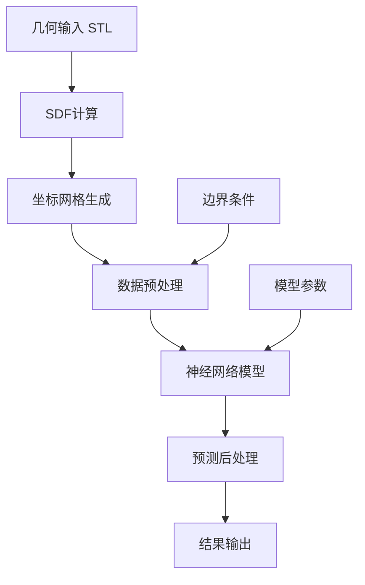

# 推理模块文档

## 模块概述
推理模块(`inference`)是ISimU项目的部署和应用模块，负责将训练好的神经网络模型应用于实际的CFD流场预测任务。该模块提供从几何输入到流场输出的端到端推理服务，支持单样本预测和批量处理。

## 模块功能

### 核心功能
- **模型预测**：加载训练好的模型进行流场预测
- **输入预处理**：几何信息和边界条件的标准化处理
- **输出后处理**：预测结果的可视化和格式转换
- **批量推理**：支持多案例的并行预测
- **性能优化**：GPU加速和内存优化

### 应用场景
- **快速流场预测**：替代昂贵的CFD仿真计算
- **参数化研究**：快速评估不同参数对流场的影响
- **实时仿真**：交互式流场分析和可视化
- **优化算法集成**：作为流场评估器用于优化算法

## 技术实现

### 核心技术栈
- **深度学习框架**：PyTorch (模型推理)
- **数值计算**：NumPy, SciPy (数据处理)
- **几何处理**：trimesh, VTK (几何输入)
- **可视化**：Matplotlib, ParaView (结果展示)
- **性能优化**：TensorRT, ONNX (推理加速)

### 推理流程


## 模块组件

### 文件结构
```
src/inference/
├── __init__.py                 # 模块入口
├── predictor.py                # 核心预测器
├── preprocessor.py             # 输入预处理
├── postprocessor.py            # 输出后处理
├── batch_processor.py          # 批量处理器
├── optimizer.py                # 推理优化
└── utils.py                    # 推理工具函数
```

### 主要组件说明

#### predictor.py - 核心预测器
```python
class FlowPredictor:
    """流场预测核心类"""

    def __init__(self, model_path, device='cuda'):
        """初始化预测器"""

    def predict(self, geometry_file, bounds=None, grid_size=(64,64,64)):
        """单样本预测"""

    def predict_batch(self, geometry_files, **kwargs):
        """批量预测"""

    def predict_from_sdf(self, sdf_field, coordinates):
        """从SDF场预测"""
```

#### preprocessor.py - 输入预处理
```python
class GeometryProcessor:
    """几何信息处理器"""

    def load_stl(self, stl_file, scale=0.001):
        """加载STL几何文件"""

    def compute_sdf(self, geometry, grid_points):
        """计算符号距离场"""

    def generate_grid(self, bounds, grid_size):
        """生成计算网格"""

class InputNormalizer:
    """输入数据标准化"""

    def normalize_coordinates(self, coords):
        """坐标标准化"""

    def normalize_sdf(self, sdf):
        """SDF标准化"""
```

#### postprocessor.py - 输出后处理
```python
class ResultProcessor:
    """预测结果处理器"""

    def apply_constraints(self, prediction, sdf):
        """应用物理约束"""

    def denormalize_output(self, prediction):
        """反标准化输出"""

    def export_to_vtk(self, prediction, filename):
        """导出VTK格式"""

    def export_to_paraview(self, prediction, filename):
        """导出ParaView格式"""
```

#### batch_processor.py - 批量处理器
```python
class BatchProcessor:
    """批量推理处理器"""

    def __init__(self, predictor, max_batch_size=8):
        """初始化批量处理器"""

    def process_directory(self, input_dir, output_dir):
        """处理目录中的所有几何文件"""

    def process_list(self, file_list, output_dir):
        """处理文件列表"""

    def parallel_predict(self, inputs, num_workers=4):
        """并行预测"""
```

## 输入输出格式

### 输入格式

#### 几何输入
```python
# STL文件输入
geometry_input = {
    'file_path': 'path/to/geometry.stl',
    'scale_factor': 0.001,      # STL缩放因子
    'unit': 'mm'                # 几何单位
}

# 网格参数
grid_params = {
    'bounds': (xmin, xmax, ymin, ymax, zmin, zmax),  # 计算域边界
    'grid_size': (64, 64, 64),                        # 网格分辨率
    'padding': 0.1                                   # 边界填充
}
```

#### 边界条件
```python
boundary_conditions = {
    'inlet_velocity': (0.1, 0.0, 0.0),  # 入口速度 m/s
    'outlet_pressure': 101325,          # 出口压力 Pa
    'wall_condition': 'no_slip',         # 壁面条件
    'temperature': 310.0                # 温度 K
}
```

### 输出格式

#### 流场预测结果
```python
prediction_result = {
    'pressure': np.ndarray,              # 压力场 [D, H, W]
    'velocity': np.ndarray,             # 速度场 [D, H, W, 3]
    'coordinates': {                     # 网格坐标
        'x': np.ndarray,                # X坐标 [D, H, W]
        'y': np.ndarray,                # Y坐标 [D, H, W]
        'z': np.ndarray                 # Z坐标 [D, H, W]
    },
    'sdf': np.ndarray,                  # 符号距离场 [D, H, W]
    'metadata': {                       # 元数据
        'grid_size': (D, H, W),
        'bounds': (xmin, xmax, ymin, ymax, zmin, zmax),
        'prediction_time': float,
        'model_version': str,
        'input_file': str
    }
}
```

#### 可视化输出
```python
# VTK格式输出
vtk_output = {
    'file_path': 'output.vts',
    'point_data': {
        'Pressure': pressure_field,
        'Velocity': velocity_field,
        'Velocity_Magnitude': velocity_mag
    },
    'field_data': {
        'SDF': sdf_field
    }
}
```

## 使用示例

### 基本推理
```python
from inference import FlowPredictor

# 初始化预测器
predictor = FlowPredictor('models/cfd_proxy_model.pth')

# 单样本预测
result = predictor.predict(
    geometry_file='Data/geo/portal_vein_A.stl',
    grid_size=(64, 64, 64)
)

# 访问结果
pressure = result['pressure']
velocity = result['velocity']
print(f"预测完成，压力范围: {pressure.min():.2f} - {pressure.max():.2f} Pa")
```

### 批量处理
```python
from inference import BatchProcessor

# 批量处理器
processor = BatchProcessor(predictor, max_batch_size=4)

# 处理目录中的所有STL文件
results = processor.process_directory(
    input_dir='geometries/',
    output_dir='results/'
)

print(f"处理完成，共处理 {len(results)} 个几何文件")
```

### 自定义预处理
```python
from inference import GeometryProcessor, InputNormalizer

# 自定义几何处理
geo_processor = GeometryProcessor()
geometry = geo_processor.load_stl('custom_geometry.stl', scale=0.001)

# 自定义网格
bounds = geometry.bounds
grid_size = (128, 128, 128)
sdf_field = geo_processor.compute_sdf(geometry, bounds, grid_size)

# 标准化输入
normalizer = InputNormalizer()
normalized_input = normalizer.normalize({
    'sdf': sdf_field,
    'coordinates': generate_grid_coordinates(bounds, grid_size)
})

# 预测
result = predictor.predict_from_sdf(
    sdf_field=normalized_input['sdf'],
    coordinates=normalized_input['coordinates']
)
```

### 结果可视化
```python
from inference import ResultProcessor
import matplotlib.pyplot as plt

# 后处理
processor = ResultProcessor()
processed_result = processor.apply_constraints(result, result['sdf'])

# 导出VTK用于ParaView
processor.export_to_vtk(processed_result, 'output/flow_field.vts')

# 快速可视化
pressure_slice = processed_result['pressure'][:, :, 32]
plt.imshow(pressure_slice.T, origin='lower', cmap='jet')
plt.colorbar(label='Pressure (Pa)')
plt.title('Pressure Field Slice')
plt.savefig('output/pressure_slice.png')
```

## 性能优化

### 推理加速
```python
# 使用TensorRT优化
from inference import TensorRTOptimizer

optimizer = TensorRTOptimizer()
optimized_model = optimizer.optimize(
    model_path='models/cfd_proxy_model.pth',
    precision='fp16'  # 半精度推理
)

# 加载优化后的模型
predictor = FlowPredictor(optimized_model, engine='tensorrt')
```

### 内存优化
```python
# 分块预测大网格
from inference import ChunkedPredictor

chunked_predictor = ChunkedPredictor(
    model_path='models/cfd_proxy_model.pth',
    chunk_size=(32, 32, 32),  # 分块大小
    overlap=2                 # 重叠区域
)

result = chunked_predictor.predict_large_grid(
    geometry_file='large_geometry.stl',
    grid_size=(256, 256, 256)
)
```

### 并行处理
```python
import concurrent.futures
from inference import FlowPredictor

def parallel_predict(geometry_files):
    """并行预测多个几何"""
    with concurrent.futures.ThreadPoolExecutor(max_workers=4) as executor:
        futures = []
        predictor = FlowPredictor('models/cfd_proxy_model.pth')

        for geom_file in geometry_files:
            future = executor.submit(predictor.predict, geom_file)
            futures.append(future)

        results = [future.result() for future in futures]

    return results
```

## 接口设计

### REST API接口
```python
from flask import Flask, request, jsonify
from inference import FlowPredictor

app = Flask(__name__)
predictor = FlowPredictor('models/cfd_proxy_model.pth')

@app.route('/predict', methods=['POST'])
def predict_api():
    """预测API接口"""
    data = request.json

    result = predictor.predict(
        geometry_file=data['geometry_file'],
        grid_size=tuple(data.get('grid_size', (64, 64, 64)))
    )

    return jsonify({
        'status': 'success',
        'pressure': result['pressure'].tolist(),
        'velocity': result['velocity'].tolist(),
        'metadata': result['metadata']
    })
```

### 命令行接口
```python
# inference_cli.py
import argparse
from inference import FlowPredictor

def main():
    parser = argparse.ArgumentParser(description='CFD流场预测工具')
    parser.add_argument('--model', required=True, help='模型文件路径')
    parser.add_argument('--geometry', required=True, help='几何文件路径')
    parser.add_argument('--output', help='输出文件路径')
    parser.add_argument('--grid-size', type=int, nargs=3, default=[64,64,64])

    args = parser.parse_args()

    predictor = FlowPredictor(args.model)
    result = predictor.predict(
        geometry_file=args.geometry,
        grid_size=tuple(args.grid_size)
    )

    if args.output:
        predictor.save_result(result, args.output)

    print("预测完成")

if __name__ == '__main__':
    main()
```

## 配置管理

### 推理配置
```python
# inference_config.yaml
model:
  path: "models/cfd_proxy_model.pth"
  device: "cuda"
  precision: "fp32"

preprocessing:
  geometry_scale: 0.001
  grid_padding: 0.1
  sdf_method: "exact"

postprocessing:
  apply_physics_constraints: true
  outside_velocity_zero: true
  pressure_range_clamp: [-1000, 1000]

optimization:
  enable_tensorrt: false
  batch_size: 4
  chunk_large_grids: true
  chunk_size: [32, 32, 32]
```

## 验证和测试

### 精度验证
```python
def validate_prediction(predictor, test_data, ground_truth):
    """验证预测精度"""
    predictions = []
    for sample in test_data:
        pred = predictor.predict(sample['geometry'])
        predictions.append(pred)

    # 计算误差指标
    mae_pressure = calculate_mae(predictions, ground_truth['pressure'])
    rmse_velocity = calculate_rmse(predictions, ground_truth['velocity'])

    return {
        'mae_pressure': mae_pressure,
        'rmse_velocity': rmse_velocity
    }
```

### 性能基准
```python
def benchmark_inference(predictor, test_cases):
    """推理性能基准测试"""
    import time

    times = []
    for case in test_cases:
        start_time = time.time()
        result = predictor.predict(case['geometry'])
        end_time = time.time()
        times.append(end_time - start_time)

    return {
        'avg_time': np.mean(times),
        'min_time': np.min(times),
        'max_time': np.max(times),
        'throughput': len(test_cases) / np.sum(times)
    }
```

## 开发状态

### 当前阶段：📋 规划中
- [x] 模块结构设计
- [ ] 核心预测器实现
- [ ] 预处理和后处理开发
- [ ] 批量处理功能
- [ ] 性能优化实现
- [ ] API接口开发

### 下一步计划
1. **基础预测器** (2-3周)
   - 实现核心预测功能
   - 集成训练好的模型
   - 基本的输入输出处理

2. **优化和扩展** (2-3周)
   - 添加性能优化
   - 实现批量处理
   - 开发API接口

3. **部署和集成** (1-2周)
   - 容器化部署
   - Web界面开发
   - 文档完善

## 使用指南

### 部署建议
- **本地部署**：直接使用Python包
- **容器部署**：Docker镜像
- **云部署**：支持AWS, Azure, GCP
- **边缘部署**：ONNX Runtime支持

### 扩展开发
- **自定义预处理**：继承GeometryProcessor
- **自定义后处理**：继承ResultProcessor
- **自定义损失函数**：集成到训练流程
- **自定义评估指标**：扩展metrics模块

---

*模块版本：v0.1 - 规划中*
*最后更新：2025-11-14*
*维护者：ISimU开发团队*